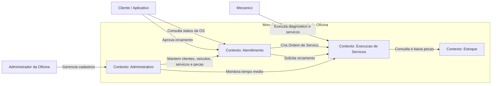
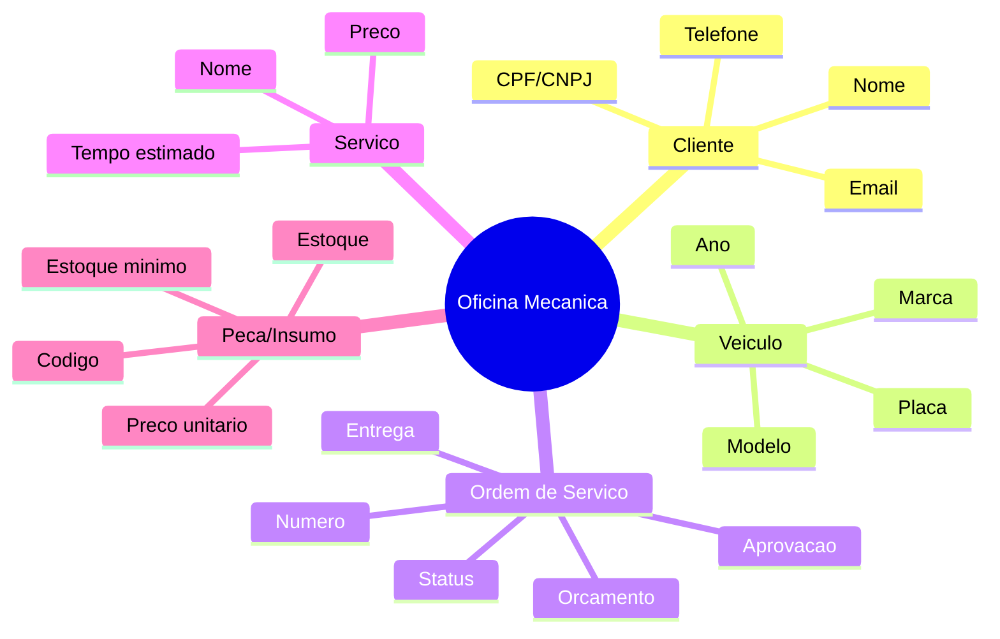
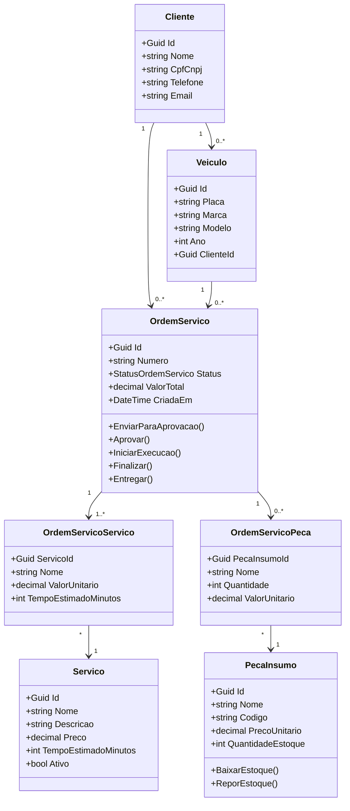
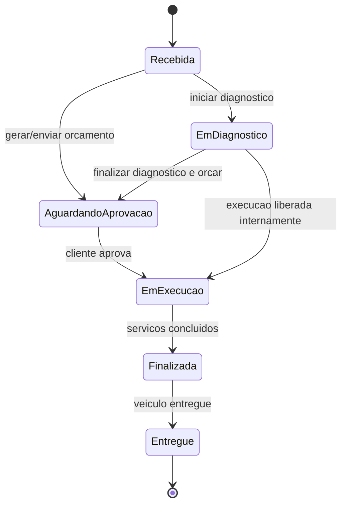
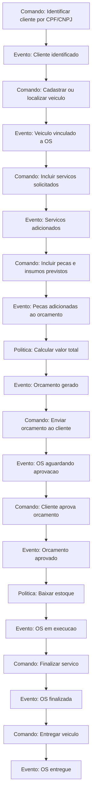
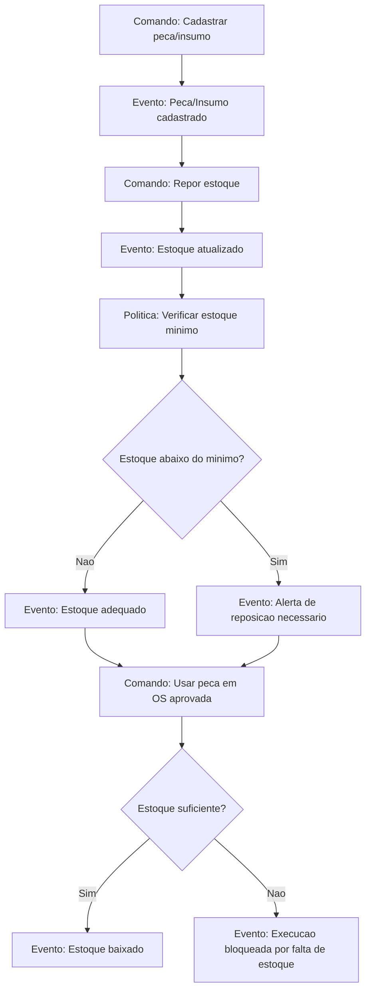
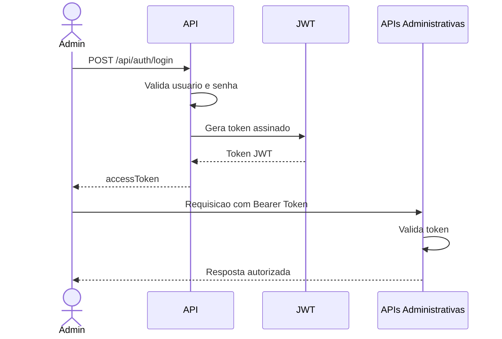
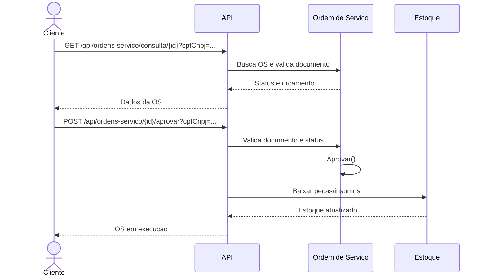

# DDD - Oficina Mecanica

Este arquivo esta em formato Mermaid. Voce pode usar em:

- Lucidchart: importar/colar Mermaid, se a opcao estiver disponivel na sua conta.
- diagrams.net/draw.io: `Arrange > Insert > Advanced > Mermaid`.
- Mermaid Live Editor: https://mermaid.live
- VS Code: extensao `Markdown Preview Mermaid Support`.

## 1. Context Map

## 2. Linguagem Ubiqua

## 3. Modelo de Dominio

## 4. Estados da Ordem de Servico

## 5. Event Storming - Criacao e Acompanhamento da OS

## 6. Event Storming - Gestao de Pecas e Insumos

## 7. Fluxo de Autenticacao Administrativa

## 8. Fluxo de Consulta e Aprovacao pelo Cliente

