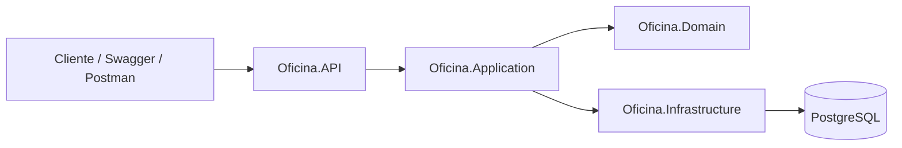
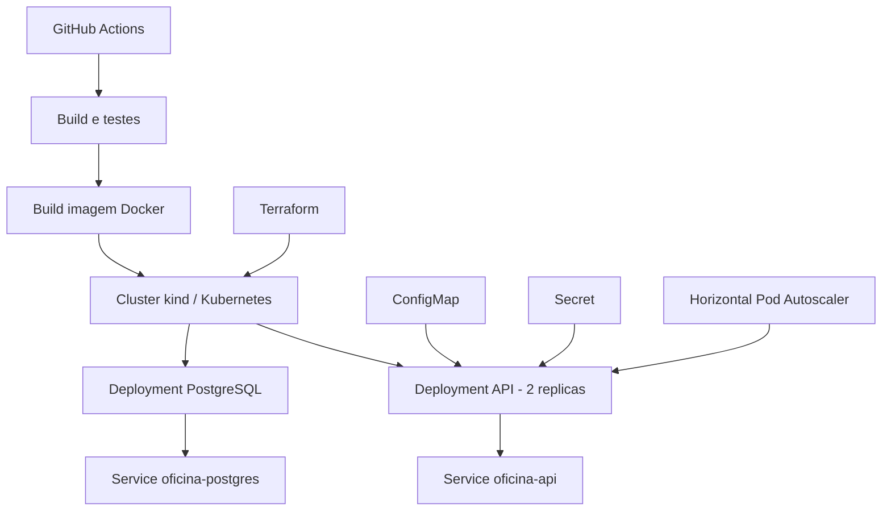

# Oficina Mecanica API

## Preparacao para EKS

Deploy da API e Job de migrations separados, segredos via IRSA/Secrets Manager,
imagem sem root e health checks distintos. Veja o [roteiro de deploy EKS](docs/deploy-eks.md).
Codigo validado localmente; provisionamento AWS e deploy continuam pendentes.
Manter `DEPLOY_ENABLED=false`. O laboratorio Kind existente permanece em `k8s/` e `infra/`.

MVP de back-end monolitico em ASP.NET Core 8 para gestao de clientes, veiculos, servicos, pecas/insumos e ordens de servico de uma oficina mecanica.

## Arquitetura

- `Oficina.Domain`: entidades, regras de status da OS, estoque e validadores de CPF/CNPJ e placa.
- `Oficina.Application`: casos de uso e servicos de aplicacao.
- `Oficina.Infrastructure`: persistencia com EF Core e PostgreSQL.
- `Oficina.API`: controllers REST, autenticacao JWT e Swagger.
- `Oficina.Tests`: testes unitarios dos dominios criticos.

## Banco de dados

Foi escolhido PostgreSQL por ser relacional, robusto, gratuito e adequado para dados transacionais da oficina: clientes, veiculos, estoque, itens da OS e 
historico precisam de integridade referencial, indices unicos e consultas administrativas consistentes.

## Executar com Docker

```powershell
docker compose up --build
```

A documentacao das APIs pode ser acessada conforme a secao Collection / Swagger.

Credenciais administrativas do MVP:

```json
{
  "usuario": "admin",
  "senha": "Admin@123"
}
```

Obtenha o token em `POST /api/auth/login` e cole somente o valor de `accessToken`
no botao `Authorize` do Swagger. Nas chamadas HTTP, use `Authorization: Bearer {token}`.

## Executar localmente

Suba um PostgreSQL local e ajuste `Oficina.API/appsettings.json` se necessario. Depois:

```powershell
dotnet restore
dotnet run --project Oficina.API/Oficina.API.csproj
```

## Endpoints principais

- `POST /api/auth/login`: gera JWT administrativo.
- `GET|POST|PUT|DELETE /api/clientes`: CRUD de clientes.
- `PATCH /api/clientes/{id}/status`: ativa/desativa cliente com JWT de administrador e corpo `{"ativo": false}`.
- `GET|POST|PUT|DELETE /api/veiculos`: CRUD de veiculos.
- `GET|POST|PUT|DELETE /api/servicos`: CRUD de servicos.
- `GET|POST|PUT|DELETE /api/pecas-insumos`: CRUD e estoque.
- `POST /api/ordens-servico`: cria OS, calcula orcamento e muda para `AguardandoAprovacao`.
- `PATCH /api/ordens-servico/{id}/status`: avanca status administrativo.
- `GET /api/ordens-servico/{id}/historico`: consulta periodos de status com JWT de administrador.
- `GET|POST /api/minhas-ordens-servico`: lista e abre OS para o cliente identificado pelo JWT do serverless.
- `GET /api/minhas-ordens-servico/{id}`: consulta uma OS do cliente autenticado.
- `POST /api/minhas-ordens-servico/{id}/aprovar`: aprova uma OS do cliente autenticado.
- `POST /api/ordens-servico/{id}/aprovar`: rota equivalente de aprovacao com JWT de cliente.
- `GET /api/ordens-servico/consulta/{id}`: acompanhamento com JWT de cliente (propria OS) ou administrador.
- `GET /api/ordens-servico/metricas/tempo-medio`: tempo medio de execucao.

## Fase 3 - Status do cliente e historico da OS

Clientes novos e preexistentes ficam ativos por padrao. A desativacao preserva seus
veiculos e ordens. O serverless consulta `ativo` ao emitir o token; a API tambem
verifica o status em cada requisicao com JWT de cliente, bloqueando clientes inativos.

A abertura da OS continua retornando **Aguardando Aprovacao**. O historico persiste
a passagem inicial de Recebida para Aguardando Aprovacao e as transicoes seguintes,
sem inventar uma etapa de diagnostico. Periodos abertos ou sem inicio conhecido
retornam `duracaoMinutos: null`.

Veja [modelagem, migracao e roteiro de validacao](docs/modelagem-status-historico.md)
e [ADR sobre o historico](docs/adrs/001-historico-status-os.md).
Esta entrega prepara os dados para observabilidade; os dashboards e a integracao
AWS ainda serao implementados.

## Fase 3 - Autorizacao de clientes com JWT

A API valida o JWT RS256 emitido por `Oficina-serverless` usando discovery/JWKS.
O cliente pode listar, abrir, consultar e aprovar somente suas OS. Cadastros,
estoque, fila operacional, historico e alteracao de status exigem administrador.
A abertura continua em **Aguardando Aprovacao**.

**Mudanca de contrato:** informar CPF na URL deixou de autorizar consultas e
aprovacoes. Essas chamadas agora exigem `Authorization: Bearer <JWT>`; o cliente
e identificado pelo `sub` assinado. A criacao pelo cliente utiliza a nova rota
`POST /api/minhas-ordens-servico`, sem CPF ou identificador de cliente no corpo.

A validacao de clientes fica desabilitada por padrao ate configurar o emissor;
isso nao libera rotas anonimas. O login administrativo permanece disponivel.

Veja [configuracao e teste local completo](docs/autenticacao-cliente-jwt.md),
[exemplo sem segredos](config/cliente-jwt.example.json) e
[ADR de autorizacao](docs/adrs/002-autorizacao-cliente-jwt.md).
Esta etapa implementa a integracao local; API Gateway, deploy AWS e CD continuam
pendentes. Mantenha `DEPLOY_ENABLED=false` durante o desenvolvimento local.


## Fase 2 - Evolucao, Infraestrutura e Automacao

Nesta fase, o projeto foi evoluido para suportar maior disponibilidade, automacao de deploy e escalabilidade. A aplicacao segue organizada em camadas, mantendo a separacao entre API, regras de aplicacao, dominio e infraestrutura.

### Objetivos aplicados

- Evolucao do fluxo de ordens de servico com abertura completa de OS contendo cliente, veiculo, servicos e pecas.
- Consulta de status da OS com os status exigidos: `Recebida`, `Diagnostico`, `Aguardando Aprovacao`, `Execucao`, `Finalizada` e `Entregue`.
- Endpoint de notificacao externa para aprovacao ou recusa de orcamento, protegido por token.
- Listagem operacional de OS ordenada por prioridade de status e data de criacao mais antiga.
- Exclusao logica da listagem operacional para OS `Finalizada` e `Entregue`.
- Testes automatizados para fluxos criticos de dominio, integracao e repositorio.
- Containerizacao com Docker e ambiente local com Docker Compose.
- Deploy em Kubernetes com Deployments, Services, ConfigMap, Secret e HPA.
- Infraestrutura como Codigo com Terraform e cluster local usando kind.
- Pipelines GitHub Actions para build, testes, imagem Docker, validacao de manifests e deploy em cluster kind temporario.

### Arquitetura da aplicacao



- `Oficina.API`: controllers, contratos HTTP, autenticacao, Swagger e configuracao da aplicacao.
- `Oficina.Application`: casos de uso e servicos de aplicacao.
- `Oficina.Domain`: entidades, validacoes e regras de negocio da oficina.
- `Oficina.Infrastructure`: EF Core, PostgreSQL, migrations e repositorios.
- `Oficina.Tests`: testes unitarios, de integracao e infraestrutura.

### Arquitetura de infraestrutura



Recursos Kubernetes em `/k8s`:

- `namespace.yaml`: namespace `oficina`.
- `configmap.yaml`: configuracoes comuns da API.
- `secret.yaml`: valores sensiveis de desenvolvimento, como senha do banco, JWT e token externo.
- `postgres-deployment.yaml` e `postgres-service.yaml`: banco PostgreSQL no cluster.
- `api-deployment.yaml` e `api-service.yaml`: API com duas replicas e porta `8080`.
- `hpa.yaml`: escalabilidade da API por CPU e memoria.

Os valores de `secret.yaml` sao apenas para ambiente local e demonstracao. Em producao, devem ser substituidos por GitHub Secrets, variaveis de ambiente do cluster ou um gerenciador de segredos.

### Fluxo de deploy

1. O GitHub Actions executa restore, build e testes da solucao .NET.
2. A imagem Docker da API e criada.
3. Os manifests Kubernetes sao validados.
4. O workflow `CI - Kind Integration` cria um cluster kind temporario.
5. A imagem Docker e carregada no cluster.
6. Os manifests de banco, API, Services, ConfigMap, Secret e HPA sao aplicados.
7. O pipeline aguarda o rollout do PostgreSQL e da API.
8. O endpoint `/health` e validado.

### Executar com Kubernetes local

Com Docker Desktop, kind, kubectl e Terraform instalados:

```powershell
cd infra
terraform init
terraform apply
```

Confirmar com `yes` quando solicitado.

Validar recursos:

```powershell
kubectl config use-context kind-oficina-local
kubectl get pods -n oficina
kubectl get svc -n oficina
kubectl get hpa -n oficina
```

A documentacao das APIs pode ser acessada conforme a secao `Collection / Swagger`.

Se a porta local nao responder no ambiente, usar port-forward:

```powershell
kubectl port-forward service/oficina-api 30081:8080 -n oficina
```

Depois acesse a documentacao conforme a secao `Collection / Swagger`.

Para remover a infraestrutura local:

```powershell
cd infra
terraform destroy
```

### Terraform

Os scripts ficam em `/infra` e provisionam um cluster Kubernetes local com kind. O Terraform tambem faz build da imagem Docker, carrega a imagem no cluster e aplica os manifests da pasta `/k8s`.

Arquivos principais:

- `infra/main.tf`: criacao do cluster e aplicacao da stack Kubernetes.
- `infra/variables.tf`: variaveis configuraveis.
- `infra/outputs.tf`: saidas uteis para teste local.
- `infra/kind-config.yaml`: configuracao do cluster kind.
- `infra/README.md`: instrucoes detalhadas de aplicacao e destruicao.

### CI/CD

Workflows em `.github/workflows`:

- `dotnet.yml`: build e testes automatizados.
- `docker-image.yml`: build da imagem Docker em PRs; publicacao no GitHub Container Registry condicionada a `DEPLOY_ENABLED=true` em pushes para `develop` ou `master`.
- `main.yml`: validacao dos manifests Kubernetes com kubeconform.
- `deploy-kind.yml`: cria cluster kind temporario no GitHub Actions, aplica manifests e valida `/health`.

### Preparacao do CI para homologacao e producao

Os quatro workflows executam em pushes para `develop` e `master`, em Pull Requests
com destino a essas branches e por acionamento manual (`workflow_dispatch`).
Uma branch `feature/*` executa o CI automaticamente ao abrir ou atualizar seu PR.

Fluxo de contribuicao:

```text
develop -> feature/* -> PR para develop -> PR para master
```

Ambientes GitHub preparados para o futuro deploy AWS:

| Ambiente | Branch autorizada |
|---|---|
| `staging` | `develop` |
| `producao` | `master` |

Em **Settings > Secrets and variables > Actions > Variables**, configure a
variavel de repositorio `DEPLOY_ENABLED` com valor `false` durante o desenvolvimento.
Com esse valor (ou com a variavel ausente), o CI continua executando build, testes,
validacao dos manifests e integracao em kind, mas nao faz login nem publica imagens
no GHCR. O kind e temporario, existe apenas no runner e nao utiliza AWS.

Com `DEPLOY_ENABLED=true`, o workflow Docker publica em pushes para `develop` e
`master`, usando a tag do commit e, respectivamente, `develop` ou `latest`.
PRs e execucoes manuais nunca publicam imagens. Essa publicacao ainda nao realiza
deploy AWS: a infraestrutura, os jobs de deploy, o OIDC e o uso dos ambientes nos
jobs serao implementados na etapa de nuvem. Alterar a variavel sozinha nao cria EKS
nem RDS e nao entrega um deploy em homologacao ou producao.

Depois da primeira execucao bem-sucedida do PR, configure protecao de `develop` e
`master` exigindo Pull Request e estes checks (nomes dos jobs exibidos no GitHub):

- `build-test`: build e testes .NET.
- `validate-k8s`: validacao dos manifests com kubeconform.
- `docker`: build do Dockerfile.
- `deploy-kind`: integracao em Kubernetes temporario e verificacao de `/health`.

Bloqueie force push e exclusao das branches e aplique as regras tambem aos
administradores. Se houver outro integrante disponivel, exija uma aprovacao.

### Collection / Swagger

A documentacao completa das APIs esta disponivel via Swagger:

- Docker/local: `http://localhost:8080/swagger`
- Kubernetes: `http://localhost:30080/swagger`
- Kubernetes via port-forward: `http://localhost:30081/swagger`

Endpoints adicionados/evoluidos na Fase 2:

- `POST /api/ordens-servico`: abertura de OS com cliente, veiculo, servicos e pecas.
- `GET /api/ordens-servico/{id}/status?cpfCnpj=...`: consulta da situacao atual da OS.
- `POST /api/ordens-servico/orcamentos/notificacoes`: notificacao externa de aprovacao ou recusa de orcamento, simulando integracao com ferramenta externa como email.
- `GET /api/ordens-servico`: listagem operacional ordenada por prioridade, sem OS finalizadas ou entregues.

Para a notificacao externa, enviar o header:

```text
X-Webhook-Token: token-dev-orcamento
```

## Testes e cobertura

```powershell
dotnet test --collect:"XPlat Code Coverage"
```

Os testes cobrem validacao de documentos, placas, fluxo de status/orcamento da OS e controle de estoque.

## Observacoes de seguranca

Foi executado um scan de vulnerabilidades com a ferramenta Snyk CLI nas dependencias NuGet da solucao OficinaMecanica.sln.

Comando executado:
snyk test --file=OficinaMecanica.sln --json > snyk-report.json

Resultado:
A analise nao identificou vulnerabilidades conhecidas nas dependencias dos projetos Oficina.API, Oficina.Domain, Oficina.Application, Oficina.Infrastructure e Oficina.Tests.

Resumo do Snyk:
- Status: aprovado
- Vulnerabilidades encontradas: 0
- Projetos analisados: 5
- Package manager: NuGet
