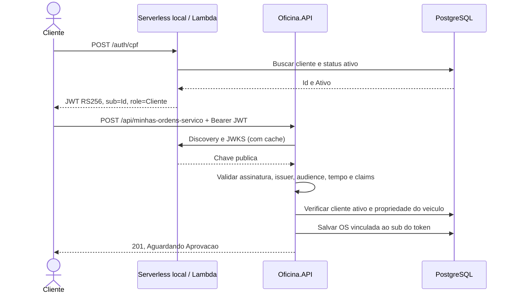

# Autenticacao serverless e autorizacao na API

## Escopo desta entrega

Integracao local com o emissor do repositorio
[Oficina-serverless](https://github.com/Venomouus/Oficina-serverless).
A API usa discovery/JWKS e valida JWT RS256, issuer, audience, expiracao, tipo
`at+jwt`, identificador e perfil do cliente. O status ativo e consultado no banco
em cada requisicao. Nao e necessario compartilhar a chave privada com a API.



## Permissoes

| Operacao | Cliente | Administrador |
|---|---|---|
| GET/POST `/api/minhas-ordens-servico` | Somente suas OS | 403 |
| GET `/api/minhas-ordens-servico/{id}` | Somente sua OS | 403 |
| POST `/api/minhas-ordens-servico/{id}/aprovar` | Somente sua OS | 403 |
| GET `/api/ordens-servico/{id}`, `/{id}/status`, `/consulta/{id}` | Somente sua OS | Todas |
| POST `/api/ordens-servico/{id}/aprovar` | Somente sua OS | 403 |
| Cadastros, estoque, POST/GET operacional de OS, PATCH status, historico e metricas | 403 | Permitido |

Sem JWT valido, essas rotas retornam 401. Cliente inativo ou inexistente tambem
recebe 401; OS de terceiro retorna 404. Falha de banco durante a autenticacao
retorna 503. O webhook `/api/ordens-servico/orcamentos/notificacoes` exige seu
segredo `X-Webhook-Token`; o JWT de cliente nao substitui esse segredo.

O parametro `cpfCnpj` das antigas URLs nao autoriza mais o acesso. O corpo de
criacao pessoal nao aceita `cliente`, `clienteId` nem `cpfCnpjCliente`.

## Configuracao da API

| Variavel de ambiente | Valor local | Finalidade |
|---|---|---|
| `ClienteJwt__Enabled` | `true` | Habilitar validacao do JWT do serverless |
| `ClienteJwt__Issuer` | `http://127.0.0.1:5081` | Deve corresponder exatamente ao JWT_ISSUER do emissor |
| `ClienteJwt__Audience` | `oficina-api` | Deve corresponder ao JWT_AUDIENCE do emissor |

O [JSON de exemplo](../config/cliente-jwt.example.json) e referencia; nao e carregado
automaticamente. O padrao em appsettings e Enabled=false, sem liberar endpoints.
Issuer deve ser uma URL sem barra final, query ou fragmento. Em producao, HTTPS e
obrigatorio. A API acessa `<issuer>/.well-known/openid-configuration` e o JWKS ali
indicado. Docker/kind nao usam o loopback do Windows: precisam de endereco de
emissor acessivel pela API e coerente com o JWT. O roteiro abaixo executa os dois
hosts .NET no Windows e somente o banco no Docker para evitar essa diferenca.

## Executar os dois hosts localmente

Use dois terminais PowerShell e Docker Desktop aberto. Utilize apenas dados de
teste. Os comandos de conexao abaixo correspondem ao Docker Compose deste repo.
Se seu banco local tiver outra porta ou credenciais, ajuste nos dois hosts.

No terminal da **Oficina-Mecanica**, na raiz do repositorio:

```powershell
docker compose up -d db
$env:ASPNETCORE_ENVIRONMENT = 'Development'
$env:ASPNETCORE_URLS = 'http://127.0.0.1:5080'
$env:ConnectionStrings__DefaultConnection = 'Host=localhost;Port=5432;Database=oficina;Username=postgres;Password=postgres'
$env:ClienteJwt__Enabled = 'true'
$env:ClienteJwt__Issuer = 'http://127.0.0.1:5081'
$env:ClienteJwt__Audience = 'oficina-api'
dotnet run --project Oficina.API --no-launch-profile
```

A API aplica as migrations existentes no banco local ao iniciar. Mantenha o
terminal aberto. Swagger: http://127.0.0.1:5080/swagger.

No terminal do **Oficina-serverless**, na raiz daquele repositorio:

```powershell
$chaveLocal = Join-Path (Get-Location) 'config/auth.local.pem'
if (!(Test-Path -LiteralPath $chaveLocal)) {
    dotnet run --project src/Oficina.Autenticacao.Local -- --generate-dev-key $chaveLocal
}
$env:ASPNETCORE_ENVIRONMENT = 'Development'
$env:ASPNETCORE_URLS = 'http://127.0.0.1:5081'
$env:DB_CONNECTION_STRING = 'Host=localhost;Port=5432;Database=oficina;Username=postgres;Password=postgres'
$env:JWT_PRIVATE_KEY_FILE = $chaveLocal
$env:JWT_ISSUER = 'http://127.0.0.1:5081'
$env:JWT_AUDIENCE = 'oficina-api'
$env:JWT_KEY_ID = 'local-2026-01'
$env:JWT_LIFETIME_SECONDS = '900'
dotnet run --project src/Oficina.Autenticacao.Local --no-launch-profile
```

Configure apenas uma fonte de chave: esse exemplo usa arquivo, portanto nao
configure tambem JWT_PRIVATE_KEY_PEM. Swagger: http://127.0.0.1:5081/swagger.

## Validar pelo Swagger

1. Na API principal, execute POST `/api/auth/login` com as credenciais locais do
   README. No botao Authorize do Swagger, cole somente o valor de `accessToken`;
   o esquema HTTP bearer acrescenta o prefixo automaticamente.
2. Cadastre um cliente de teste ativo e um servico. Guarde o CPF e o ID do servico.
3. No Swagger do serverless, execute POST `/auth/cpf` com `{"cpf":"CPF_DO_CLIENTE"}`.
4. Na API principal, substitua o token administrativo pelo `accessToken` do cliente.
5. Execute POST `/api/minhas-ordens-servico` com o corpo abaixo, substituindo o UUID
   pelo ID do servico cadastrado. Use uma placa ainda livre ou do proprio cliente.

```json
{
  "veiculo": { "placa": "JWT1234", "marca": "Fiat", "modelo": "Uno", "ano": 2020 },
  "servicosIds": ["SUBSTITUA_PELO_UUID_DO_SERVICO"],
  "pecas": [],
  "observacoes": "Teste local de autenticacao"
}
```

6. Verifique 201 e status `Aguardando Aprovacao`. Consulte a lista pessoal e a OS.
7. Execute POST `/api/minhas-ordens-servico/{id}/aprovar`: deve retornar `Execucao`.
8. Autentique outro cliente cadastrado e tente consultar/aprovar a mesma OS: 404.
9. Remova o token e tente consultar usando apenas CPF na URL: 401. Com token de
   cliente, tente GET `/api/clientes`: 403.
10. Com token administrativo, desative o primeiro cliente via PATCH
    `/api/clientes/{id}/status`, corpo `{"ativo":false}`. O token ja emitido desse
    cliente passa a receber 401; nova autenticacao no serverless tambem recebe 401.

## Testes automatizados e evidencia

```powershell
dotnet test OficinaMecanica.sln --configuration Release
```

Os testes de integracao exercitam o middleware real com assinaturas RSA, chave
publica e metadados controlados, incluindo isolamento entre clientes, criacao,
aprovacao, permissoes administrativas, expiracao, issuer/audience incorretos,
assinatura invalida, perfil/escopo/tipo incorretos, desativacao e falha de banco.
Esses testes usam banco em memoria; os testes relacionais existentes usam SQLite.

Tambem foi executado o fluxo com PostgreSQL 16 descartavel, os dois hosts HTTP e
discovery/JWKS real: CPF, JWT, criacao, consulta, aprovacao, isolamento, desativacao
e indisponibilidade do banco. Isso valida a integracao local, sem comprovar deploy AWS.


