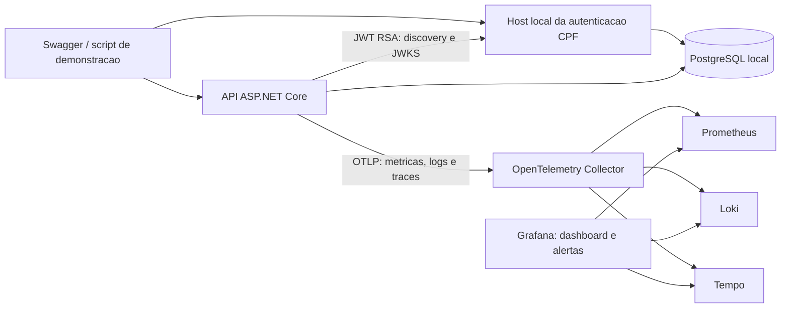
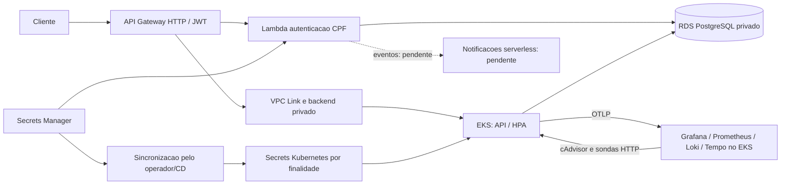
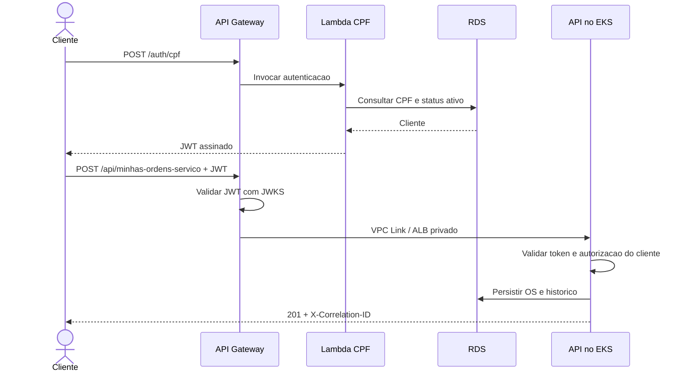
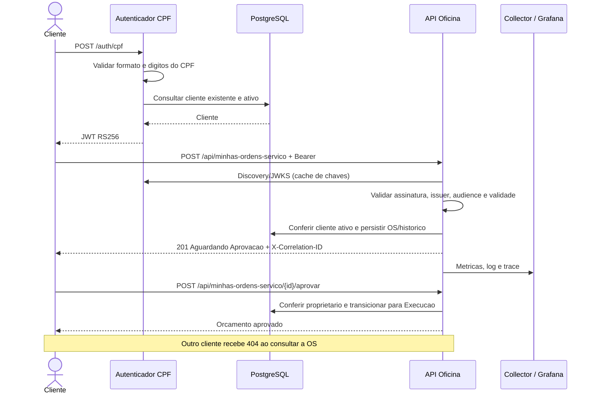
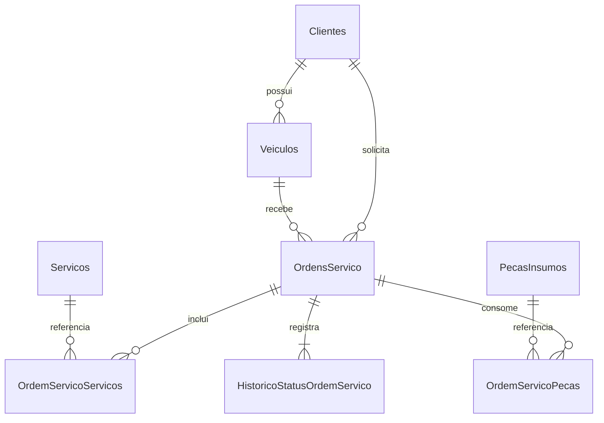

# Arquitetura e modelagem da entrega

## Componentes executados localmente

O PostgreSQL desse Compose usa credencial administrativa exclusivamente para facilitar
a demonstracao. A segregacao app/auth/migrations e o bootstrap de privilegios do
repositorio de banco sao artefatos separados; nao se deve atribuir esses privilegios
restritos a este Compose. As migracoes locais sao aplicadas em Development; em EKS
existe Job separado, com migracoes automaticas no startup desabilitadas.

## Arquitetura implantada no AWS Academy

EKS, RDS, Lambda, Gateway e monitoramento foram provisionados no Academy. O fluxo
de homologacao foi demonstrado; veja `evidencias-aws.json`. LabRole e reutilizada
pelos servicos permitidos no laboratorio. API/migrations recebem apenas seus segredos
montados, sem credenciais AWS. Homologacao e producao usam namespaces e bancos logicos
separados no mesmo cluster/RDS. O monitoramento usa armazenamento temporario de demo.

## Sequencia local de autenticacao e abertura de OS

## Modelo relacional

Os nomes dos itens no diagrama representam entidades de associacao; o mapeamento
fisico exato esta em `Oficina.Infrastructure/Persistence/OficinaDbContext.cs`.
Cliente/veiculo/catalogos sao referenciados por chaves estrangeiras. CPF e placa
possuem unicidade. Itens da OS preservam valores do orcamento, evitando que alteracoes
posteriores do catalogo mudem o historico financeiro. O historico usa sequencia unica
por OS e datas UTC; o agregado fecha/abre periodos numa mesma persistencia.

O PostgreSQL foi escolhido por transacoes ACID, integridade referencial, indices e
consultas relacionais adequadas a clientes, estoque e OS. RDS e a opcao gerenciada
preparada para backups/operacao futura, mas o banco local nao e gerenciado. Os testes
nao substituem benchmark de producao. A consulta de observabilidade agrega sete dias
de criacao e periodos encerrados em 24h; para volume grande, avaliar EXPLAIN, indices
e agregacao incremental antes de reduzir intervalos. A concorrencia da OS usa Versao;
disputa de estoque entre OS distintas permanece uma limitacao conhecida.

## Decisoes e referencias

- [ADR de observabilidade local](../adrs/003-observabilidade-local.md).
- [ADR de HPA e comunicacao](../adrs/004-hpa-comunicacao.md).
- [RFC da entrega local e escolhas de plataforma](rfc-entrega-local.md).
- [Historico e concorrencia](../adrs/001-historico-status-os.md).
- [Autorizacao de clientes](../adrs/002-autorizacao-cliente-jwt.md).
- [Modelagem temporal detalhada](../modelagem-status-historico.md).
- [Deploy EKS e migrations](../deploy-eks.md).
- RFCs e ADRs de plataforma/RDS/Gateway nos repositorios de infraestrutura.
