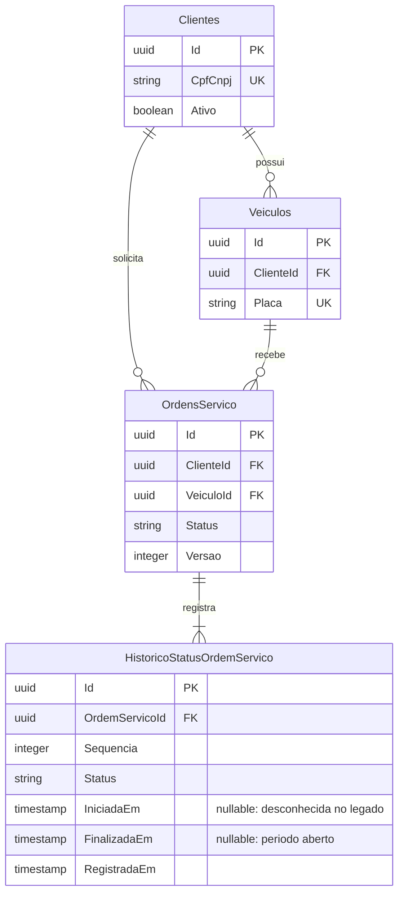

# Status do cliente e historico de ordens de servico

## Responsabilidades

As entidades, migrations e regras continuam em `Oficina-Mecanica`, nas quatro
camadas .NET existentes. O repositorio `Oficina-infra-database` provisionara o RDS;
nao deve gerenciar as mesmas tabelas pelo Terraform.

`Clientes.Ativo` representa a situacao cadastral consultavel pela futura Lambda de
autenticacao. Novos clientes e os clientes migrados comecam ativos. Desativar nao
exclui veiculos nem ordens e nao invalida automaticamente JWTs ja emitidos.
Nesta etapa, as rotas antigas continuam com suas regras de acesso existentes;
a verificacao de cliente ativo na autenticacao serverless ainda esta pendente.

## Modelo relacional (recorte das entidades afetadas)



Cada transicao fecha o periodo anterior e abre o seguinte no mesmo instante UTC.
O status atual, a versao e os periodos sao persistidos no mesmo `SaveChanges` e na
mesma transacao relacional. A consulta do agregado carrega o historico completo.
O indice unico `(OrdemServicoId, Sequencia)` impede sequencias repetidas;
`(Status, IniciadaEm)` apoia filtros por status e intervalo de inicio. As constraints
exigem sequencia positiva e fim maior ou igual ao inicio conhecido (ou ao registro
quando o inicio e desconhecido). A regra de um unico periodo aberto e mantida pelo
agregado; nao existe constraint parcial no banco para essa regra.

`Versao` e um token de concorrencia incrementado nas transicoes e respostas de
orcamento. Disputas sobre a mesma OS retornam HTTP 409: consultar novamente antes
de repetir. No PostgreSQL, uma violacao do indice de sequencia tambem e traduzida
para conflito. Atualizacoes de OS distintas disputando o estoque de uma mesma peca
nao sao resolvidas por esse token; isso exige controle de concorrencia do estoque.

## Fluxo preservado

`POST /api/ordens-servico` continua calculando o orcamento e retornando
`Aguardando Aprovacao`. A entidade passa por `Recebida` durante a criacao e ambos
os registros sao salvos juntos. Nenhum periodo `Diagnostico` e criado nesse caminho.
As regras de dominio ainda suportam `Recebida -> Diagnostico`; a API atual nao
oferece uma abertura que permaneca em `Recebida`.

A aprovacao e o inicio administrativo da execucao registram `Execucao`; finalizar
e entregar registram os respectivos periodos. Recusar ou reenviar um orcamento
enquanto aguarda aprovacao nao divide o periodo. Reenviar uma OS ja em execucao,
finalizada ou entregue e rejeitado para evitar reabertura e nova baixa de estoque.

O tempo de `Finalizada` mede a espera entre finalizar e entregar, nao o trabalho
anterior de execucao. O ultimo periodo `Entregue` permanece aberto. A duracao em
minutos so e calculada para periodos com inicio e fim conhecidos. Para um futuro
dashboard, ausencia de diagnostico significa **sem amostras**, nunca duracao zero.

## Migracao

`20260913192237_AddClienteAtivoHistoricoStatus` adiciona `Ativo=true`, `Versao=0`,
tabela e indices. Para cada OS existente, insere apenas seu status atual com
`Sequencia=1`, `IniciadaEm=NULL`, `FinalizadaEm=NULL` e `RegistradaEm` no instante da
migracao. Reutiliza o UUID da OS como UUID desse primeiro registro (tabelas distintas).
Nenhum historico passado e reconstruido com datas estimadas. As proximas transicoes
passam a ter datas exatas. Servicos e pecas de seed ja existentes sao preservados.

Para gerar e revisar o SQL sem conectar ao banco:

```powershell
dotnet tool restore
dotnet ef migrations script 20260712150000_AddOrcamentoDecisionFields 20260913192237_AddClienteAtivoHistoricoStatus --project Oficina.Infrastructure --startup-project Oficina.API --output "$env:TEMP\oficina-status-historico.sql"
```

Para aplicar em uma copia local de testes, configure `ConnectionStrings__DefaultConnection`
com a conexao do seu PostgreSQL e execute:

```powershell
dotnet ef database update --project Oficina.Infrastructure --startup-project Oficina.API
```

A API ja executa migrations ao iniciar fora de `Testing`. Portanto, iniciar a API
ou `docker compose up --build` tambem atualiza o banco configurado. Antes de usar
um banco com dados importantes, faca backup e ensaie a migracao em uma copia.
O rollback `Down` remove o historico e o campo Ativo; ele perde esses dados.
Para EKS, a execucao coordenada de migrations devera fazer parte do deploy futuro.

## Validacao

```powershell
dotnet test OficinaMecanica.sln --configuration Release
```

Os testes exercitam dominio com relogio controlado, endpoints HTTP com EF InMemory
e persistencia/transacoes com SQLite temporario. SQLite nao valida o SQL especifico
da migration PostgreSQL. Ensaiar a migracao no PostgreSQL continua necessario:

1. Em uma copia com a migration anterior, mantenha clientes e OS em varios status.
2. Aplique a nova migration; confira clientes ativos, dados antigos preservados e
   um periodo por OS antiga com inicio nulo.
3. Aprove uma OS antiga aguardando aprovacao; confira o fechamento do periodo
   legado sem duracao calculada e abertura de Execucao.
4. Abra uma OS nova; confira status Aguardando Aprovacao e ausencia de Diagnostico.

No Swagger existente, autentique como administrador e teste:

| Operacao | Resultado |
|---|---|
| `PATCH /api/clientes/{id}/status`, `{"ativo":false}` | 200; cliente inativo, relacionamentos preservados |
| Mesmo endpoint, `{"ativo":true}` | 200; cliente reativado |
| Mesmo endpoint, `{}` | 400; campo obrigatorio |
| `GET /api/ordens-servico/{id}/historico` | 200; periodos ordenados pela sequencia |
| Novos endpoints sem JWT / sem papel Admin | 401 / 403 |
| Novos endpoints com ID inexistente (Admin) | 404 |

O contrato de historico inclui sequencia, status, inicio, fim, data de registro e
duracao. Estes dados preparam as metricas por status exigidas no Tech Challenge;
o dashboard e o fluxo de demonstracao do diagnostico ainda precisam ser resolvidos.
